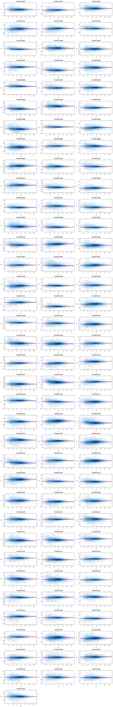
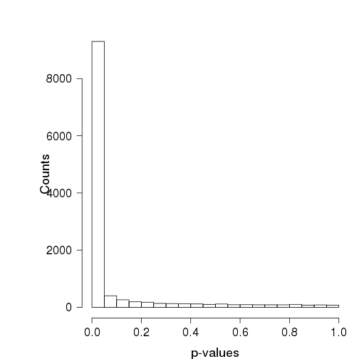
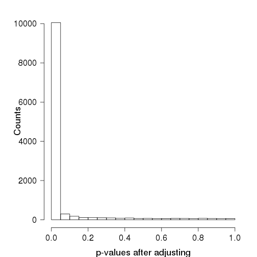
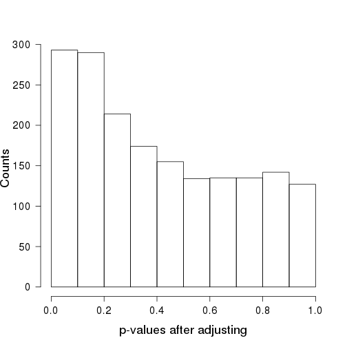
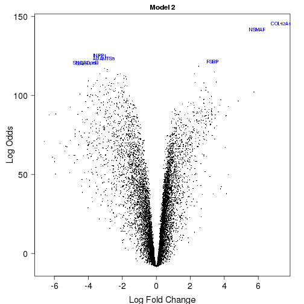

<style type="text/css">
/* Based on the bioconductor.css file from the BiocStyle package */

body, td {
   font-family: sans-serif;
   background-color: white;
   font-size: 13px;
}

body {
  max-width: 800px;
  margin: 0 auto;
  padding: 1em 1em 2em;
  line-height: 20px;
}

/* Table of contents style */

div#TOC li {
    list-style:none;
    background-image:none;
    background-repeat:none;
    background-position:0;
}

/* element spacing */

p, pre { 
  margin: 0em 0em 1em;
}

/* center images and tables */
img, table {
  margin: 0em auto 1em;
}

p {
  text-align: justify;
}

tt, code, pre {
   font-family: 'DejaVu Sans Mono', 'Droid Sans Mono', 'Lucida Console', Consolas, Monaco, monospace;
}

h2, h3, h4, h5, h6 { 
  font-family: Helvetica, Arial, sans-serif;
  margin: 1.2em 0em 0.6em 0em;
  font-weight: bold;
}

h1.title {
  font-size: 250%;
  font-weight: bold;
  color: #1a81c2;
  line-height: 1.4em;
  margin-top: 20px;
  border-bottom: 1px #1a81c2 solid;
}


h1 {
  font-size: 250%;
  font-weight: bold;
  line-height: 1.4em;
  margin-top: 20px;
  border-bottom: 1px #1a81c2 solid;
}

h2 {
  font-size: 160%;  
}

h1, h2, h3 {
  color: #1a81c2;
}


h3, h4, h5, h6 {
  font-size:115%;
} /* not expecting to dive deeper than four levels on a single page */

/* links are simply blue, hovering slightly less blue */
a { color: #1a81c2; text-decoration: none; }
a:active { outline: none; }
a:visited { color: #1a81c2; }
a:hover { color: #4c94c2; }

pre, img {
  max-width: 100%;
  display: block;
}

pre {
  border: 0px none;
  background-color: #F8F8F8;
  white-space: pre;
  overflow-x: auto;
}

pre code {
  border: 1px #aaa dashed;
  background-color: white;
  display: block;
  padding: 1em;  
  color: #111;
  overflow-x: inherit;
}

/* markdown v1 */
pre code[class] {
  background-color: inherit;
}

/* markdown v2 */
pre[class] code {
  background-color: inherit;
}

/* formatting of inline code */
code { 
  background-color: transparent;
  color: #87b13f;
  font-size: 92%;
}

/* formatting of tables */

table, td, th {
  border: none;
  padding: 0 0.5em;
}

/* alternating row colors */
tbody tr:nth-child(odd) td {
  background-color: #F8F8F8;
}

blockquote {
   color:#666666;
   margin:0;
   padding-left: 1em;
   border-left: 0.5em #EEE solid;
}

hr {
   height: 0px;
   border-bottom: none;
   border-top-width: thin;
   border-top-style: dotted;
   border-top-color: #999999;
}

span.header-section-number {
  padding-right: 1em;
}

span.toc-section-number::after {
    content: "  ";
    white-space: pre;
}

.caption {
  font-style: italic;
  text-align: center;
  margin-top: 2px;
  margin-bottom: 25px;
  font-size: 11pt;
}

@media print {
   * {
      background: transparent !important;
      color: black !important;
      filter:none !important;
      -ms-filter: none !important;
   }

   body {
      font-size:12pt;
      max-width:100%;
   }

   hr {
      visibility: hidden;
      page-break-before: always;
   }

   pre, blockquote {
      padding-right: 1em;
      page-break-inside: avoid;
   }

   tr, img {
      page-break-inside: avoid;
   }

   img {
      max-width: 100% !important;
   }

   @page :left {
      margin: 15mm 20mm 15mm 10mm;
   }

   @page :right {
      margin: 15mm 10mm 15mm 20mm;
   }

   p, h2, h3 {
      orphans: 3; widows: 3;
   }

   h2, h3 {
      page-break-after: avoid;
   }

   .caption {
     font-style: italic;
     text-align: center;
     margin-top: 2px;
     margin-bottom: 25px;
     font-size: 11pt;
   }

}
</style>

# Analysis of a TCGA RNA-seq data set on Breast invasive carcinoma

### Ainhoa Garcia (ainhoa.garcia03@estudiant.upf.edu), Joan F. Gilabert (joanfrancesc.gilabert01@estudiant.upf.edu) and Leo (leonardopablonicolas.madsen01@estudiant.upf.edu)

## Introduction
Breast invasive carcinoma (BRCA), is the most common malignant cancer affecting women and is the second leading cause of cancer death worldwide. This disease has more than 1,300,000 cases and 450,000 death each year around the world[3]. This disease is widely heterogeneous, having a large and diverse set of molecular, histological and clinical behaviors depending of the tumour. The Cancer Genome Atlas (TCGA) has comprehensively profiled this type of cancer in a patient cohort. Here we analyze the expression profiles of those patients, accessible in the form of a raw RNA-seq counts produced by
[Rahman et al. (2015)](http://bioinformatics.oxfordjournals.org/content/31/22/3666.short) using a pipeline based on the R/Bioconductor software package [Rsubread](http://bioconductor.org/packages/Rsubread).

## Data import

We start importing the raw table of counts.


```r
library(SummarizedExperiment)

se <- readRDS(file.path("data/seBRCA.rds"))
se
```

```
class: RangedSummarizedExperiment 
dim: 20115 1232 
metadata(5): experimentData annotation cancerTypeCode
  cancerTypeDescription objectCreationDate
assays(1): counts
rownames(20115): 1 2 ... 102724473 103091865
rowData names(3): symbol txlen txgc
colnames(1232): TCGA.3C.AAAU.01A.11R.A41B.07
  TCGA.3C.AALI.01A.11R.A41B.07 ... TCGA.GI.A2C8.11A.22R.A16F.07
  TCGA.GI.A2C9.11A.22R.A21T.07
colData names(549): type bcr_patient_uuid ...
  lymph_nodes_aortic_pos_by_ihc lymph_nodes_aortic_pos_total
```

Explore the column (phenotypic) data, which in this case corresponds to clinical
variables, and their corresponding metadata.


```r
dim(colData(se))
```

```
[1] 1232  549
```

```r
colData(se)[1:5, 1:5]
```

```
DataFrame with 5 rows and 5 columns
                                 type                     bcr_patient_uuid
                             <factor>                             <factor>
TCGA.3C.AAAU.01A.11R.A41B.07    tumor 6E7D5EC6-A469-467C-B748-237353C23416
TCGA.3C.AALI.01A.11R.A41B.07    tumor 55262FCB-1B01-4480-B322-36570430C917
TCGA.3C.AALJ.01A.31R.A41B.07    tumor 427D0648-3F77-4FFC-B52C-89855426D647
TCGA.3C.AALK.01A.11R.A41B.07    tumor C31900A4-5DCD-4022-97AC-638E86E889E4
TCGA.4H.AAAK.01A.12R.A41B.07    tumor 6623FC5E-00BE-4476-967A-CBD55F676EA6
                             bcr_patient_barcode form_completion_date
                                        <factor>             <factor>
TCGA.3C.AAAU.01A.11R.A41B.07        TCGA-3C-AAAU            2014-1-13
TCGA.3C.AALI.01A.11R.A41B.07        TCGA-3C-AALI            2014-7-28
TCGA.3C.AALJ.01A.31R.A41B.07        TCGA-3C-AALJ            2014-7-28
TCGA.3C.AALK.01A.11R.A41B.07        TCGA-3C-AALK            2014-7-28
TCGA.4H.AAAK.01A.12R.A41B.07        TCGA-4H-AAAK           2014-11-13
                             prospective_collection
                                           <factor>
TCGA.3C.AAAU.01A.11R.A41B.07                     NO
TCGA.3C.AALI.01A.11R.A41B.07                     NO
TCGA.3C.AALJ.01A.31R.A41B.07                     NO
TCGA.3C.AALK.01A.11R.A41B.07                     NO
TCGA.4H.AAAK.01A.12R.A41B.07                    YES
```

```r
mcols(colData(se), use.names=TRUE)
```

```
DataFrame with 549 rows and 2 columns
                                                         labelDescription
                                                              <character>
type                                           sample type (tumor/normal)
bcr_patient_uuid                                         bcr patient uuid
bcr_patient_barcode                                   bcr patient barcode
form_completion_date                                 form completion date
prospective_collection            tissue prospective collection indicator
...                                                                   ...
lymph_nodes_pelvic_pos_total                               total pelv lnp
lymph_nodes_aortic_examined_count                           total aor lnr
lymph_nodes_aortic_pos_by_he                          aln pos light micro
lymph_nodes_aortic_pos_by_ihc                                 aln pos ihc
lymph_nodes_aortic_pos_total                                total aor-lnp
                                        CDEID
                                  <character>
type                                       NA
bcr_patient_uuid                           NA
bcr_patient_barcode                   2673794
form_completion_date                       NA
prospective_collection                3088492
...                                       ...
lymph_nodes_pelvic_pos_total          3151828
lymph_nodes_aortic_examined_count     3104460
lymph_nodes_aortic_pos_by_he          3151832
lymph_nodes_aortic_pos_by_ihc         3151831
lymph_nodes_aortic_pos_total          3151827
```
These metadata consists of two columns of information about the clinical variables.
One called `labelDescription` contains a succinct description of the variable, often
not more self-explanatory than the variable name itself, and the other called
'CDEID' corresponds to the so-called `Common Data Element (CDE)` identifier. This
identifier can be use in https://cdebrowser.nci.nih.gov to search for further
information about the associated clinical variable using the `Advanced search`
form and the `Public ID` attribute search.

Now, explore the row (feature) data.


```r
rowRanges(se)
```

```
GRanges object with 20115 ranges and 3 metadata columns:
            seqnames               ranges strand |      symbol     txlen
               <Rle>            <IRanges>  <Rle> | <character> <integer>
          1    chr19 [58345178, 58362751]      - |        A1BG      3322
          2    chr12 [ 9067664,  9116229]      - |         A2M      4844
          9     chr8 [18170477, 18223689]      + |        NAT1      2280
         10     chr8 [18391245, 18401218]      + |        NAT2      1322
         12    chr14 [94592058, 94624646]      + |    SERPINA3      3067
        ...      ...                  ...    ... .         ...       ...
  100996331    chr15 [20835372, 21877298]      - |       POTEB      1706
  101340251    chr17 [40027542, 40027645]      - |    SNORD124       104
  101340252     chr9 [33934296, 33934376]      - |   SNORD121B        81
  102724473     chrX [49303669, 49319844]      + |      GAGE10       538
  103091865    chr21 [39313935, 39314962]      + |   BRWD1-IT2      1028
                 txgc
            <numeric>
          1 0.5644190
          2 0.4882329
          9 0.3942982
         10 0.3895613
         12 0.5249429
        ...       ...
  100996331 0.4308324
  101340251 0.4903846
  101340252 0.4074074
  102724473 0.5055762
  103091865 0.5924125
  -------
  seqinfo: 455 sequences (1 circular) from hg38 genome
```

This feature data provides information about the genes, their symbols, location in the genome, length and gc content.

## Creation of subsets

We focus on a subset of our data to perform the analysis. To create this subset we use a paired data criterion. That is, we keep only the data corresponding to patient that have samples of tumor and normal type. We use this criterion in order the minimize the genomic variability and supposedly reduce the probability of having confounding factors in our data. The following code performs this filtering:


```r
codesnorm <- colData(se)[colData(se)$type == "normal",]$bcr_patient_barcode
codestum <- colData(se)[colData(se)$type == "tumor",]$bcr_patient_barcode
commoncodes <- codesnorm[codesnorm %in% codestum]
se <- se[,colData(se)$bcr_patient_barcode %in% commoncodes]
dim(se)
```

```
[1] 20115   212
```

```r
table(se$type)
```

```

normal  tumor 
   106    106 
```

As we can see our filtered data-set consists now of 20115 genes for 212 samples, half of which are tumor type and the other half are normal samples.

## Quality assessment and normalization

To perform quality assessment and normalization we need first to load the
[edgeR](http://bioconductor.org/packages/edgeR) R/Bioconductor package and
create a `DGEList' object.


```r
library(edgeR)
names(se) <- rowRanges(se)$symbol
dge <- DGEList(counts=assays(se)$counts, genes=mcols(se))
```
Now calculate $\log_2$ CPM values of expression and put them as an additional
assay element to ease their manipulation.


```r
assays(se)$logCPM <- cpm(dge, log=TRUE, prior.count=0.5)
assays(se)$logCPM[1:5, 1:5]
```

```
         TCGA.A7.A0CE.01A.11R.A00Z.07 TCGA.A7.A0CH.01A.21R.A00Z.07
A1BG                         1.119416                     2.494770
A2M                          9.200341                     8.459248
NAT1                        -6.573341                    -6.573341
NAT2                        -6.573341                    -6.573341
SERPINA3                     5.657967                     5.022802
         TCGA.A7.A0D9.01A.31R.A056.07 TCGA.A7.A13F.01A.11R.A12P.07
A1BG                         2.139362                     3.796120
A2M                          9.462463                     9.682542
NAT1                        -6.573341                    -6.573341
NAT2                        -6.573341                    -6.573341
SERPINA3                     5.812733                     4.961102
         TCGA.AC.A23H.01A.11R.A157.07
A1BG                       -0.5202016
A2M                         8.1727633
NAT1                       -6.5733408
NAT2                       -6.5733408
SERPINA3                    5.6981573
```
### Library sizes

Let's examine the library sizes in terms of total number of sequence read counts
per sample. Figure S1 below shows library sizes per sample in increasing order.

<p class="caption">Figure S1: Library sizes in increasing order.</p>

This figure reveals substantial differences in sequencing depth between samples, although this differences are quite homogeneously distributed between normal and tumor samples. We might filter the samples that have a library size with an extreme value, although that would disrupt our paired subset, so we decided to leave all samples. 

### Distribution of expression levels among samples

Let's look at the distribution of expression values per sample in terms of
logarithmic CPM units. Due to the large number of samples, we display tumor
and normal samples separately, and are shown in Figure S2.

<p class="caption">Figure S2: Non-parametric density distribution of expression profiles per sample.</p>
In the figure we do not appreciate remarkable differences between the distribution of tumor samples and normal samples.

### Distribution of expression levels among genes

Let's calculate now the average expression per gene through all the samples. Figure S3
shows the distribution of those values across genes.

<p class="caption">Figure S3: Distribution of average expression level per gene.</p>

### Filtering of lowly-expressed genes

In the light of this plot, we may consider a cutoff of 1 log CPM unit as minimum value
of expression to select genes being expressed across samples. Using this cutoff we proceed
to filter out lowly-expressed genes.


```r
mask <- avgexp > 1
dim(se)
```

```
[1] 20115   212
```

```r
dim(dge)
```

```
[1] 20115   212
```

```r
se <- se[mask, ]
dge <- dge[mask, ]
dim(se)
```

```
[1] 11855   212
```

```r
dim(dge)
```

```
[1] 11855   212
```

### Normalization

We calculate now the normalization factors on the filtered expression data set.


```r
dge <- calcNormFactors(dge)
```

Replace the raw log2 CPM units in the corresponding assay element of the `SummarizedExperiment`
object, by the normalized ones.


```r
assays(se)$logCPM <- cpm(dge, log=TRUE, prior.count=0.5)
```

### MA-plots

We examine now the MA-plots of the normalized expression profiles. We look first to
the tumor samples.
<p class="caption">Figure S4: MA-plots of the tumor samples.</p>
We do not observe samples with major expression-level dependent biases. Let's look now to the normal samples.

<p class="caption">Figure S5: MA-plots of the normal samples.</p>

Again, we do not observe either important expression-level dependent biases among the normal samples.

### Batch identification

We will search now for potential surrogate of batch effect indicators. Given that each sample
names corresponds to a TCGA barcode (see https://wiki.nci.nih.gov/display/TCGA/TCGA+barcode),
following the strategy described in http://bioinformatics.mdanderson.org/main/TCGABatchEffects:Overview
we are going to derive different elements of the TCGA barcode and examine their distribution
across samples.


```r
tss <- substr(colnames(se), 6, 7)
table(tss)
```

```
tss
 A7  AC  BH  E2  E9  GI 
  8   8 142  20  30   4 
```

```r
center <- substr(colnames(se), 27, 28)
table(center)
```

```
center
 07 
212 
```

```r
plate <- substr(colnames(se), 22, 25)
table(plate)
```

```
plate
A00Z A056 A084 A089 A115 A12D A12P A137 A13Q A144 A14D A14M A157 A169 A16F 
   5   14    3   20   10   30   26   14   26   12   10    6   18    6    2 
A17B A19E A19W A21T A466 
   4    1    2    2    1 
```

```r
portionanalyte <- substr(colnames(se), 18, 20)
table(portionanalyte)
```

```
portionanalyte
11R 12R 13R 21R 22R 23R 24R 31R 32R 33R 34R 41R 42R 43R 51R 52R 53R 61R 
 79  13   9  23  15  12   1  10  10  10   4   3   9   5   1   1   2   1 
62R 71R 73R 94R 
  1   1   1   1 
```

```r
samplevial <- substr(colnames(se), 14, 16)
table(samplevial)
```

```
samplevial
01A 01B 11A 11B 
105   1  93  13 
```

From this information we can make the following observations:

  * All samples were sequenced at the same center

  * All samples belong to one of two combinations of tissue type and vial, matching the
    expected tumor and normal distribution, vials 01A and 01B correspond to tumor samples and 11A and 11B correspond to normal samples.

  * Samples were collected across different tissue source sites (TSS).
  
We are going to use the TSS as surrogate of batch effect indicator. Considering our outcome
of interest as molecular changes between sample types, tumor vs. normal, we will examine now
the cross-classification of this outcome with TSS.


```r
table(data.frame(TYPE=se$type, TSS=tss))
```

```
        TSS
TYPE     A7 AC BH E2 E9 GI
  normal  4  4 71 10 15  2
  tumor   4  4 71 10 15  2
```

We see that the samples of each type are perfectly balanced over the TSS. We examine now how samples group together by hierarchical clustering and multidimensional
scaling, annotating the outcome of interest and the the surrogate of batch indicator. We
calculate again log CPM values with a higher prior count to moderate extreme fold-changes
produced by low counts. The resulting dendrogram is shown in Figure S6.


```r
logCPM <- cpm(dge, log=TRUE, prior.count=3)
d <- as.dist(1-cor(logCPM, method="spearman"))
sampleClustering <- hclust(d)
batch <- as.integer(factor(tss))
sampleDendrogram <- as.dendrogram(sampleClustering, hang=0.1)
names(batch) <- colnames(se)
outcome <- paste(substr(colnames(se), 9, 12), as.character(se$type), sep="-")
names(outcome) <- colnames(se)
sampleDendrogram <- dendrapply(sampleDendrogram,
                               function(x, batch, labels) {
                                 if (is.leaf(x)) {
                                   attr(x, "nodePar") <- list(lab.col=as.vector(batch[attr(x, "label")]))
                                   attr(x, "label") <- as.vector(labels[attr(x, "label")])
                                 }
                                 x
                               }, batch, outcome)

plot(sampleDendrogram, main="Hierarchical clustering of samples",cex.lab=1.5, cex.axis=1.5, cex.main=1.5)
legend("topright", paste(levels(factor(tss))), fill=sort(unique(batch)))
```

<p class="caption">Figure S6: Hierarchical clustering of the samples.</p>

We can observe that samples cluster primarily by sample type, tumor or normal. TSS seems to have a stronger effect among the normal samples, while it distributes better among the tumor samples. We may consider discarding samples that do not seem to cluster as well across batches.

In Figure S7 we show the corresponding MDS plot. Here we see more clearly that the first source of variation separates tumor from normal samples. We can also observe that a few normal samples are separated from the rest, in a more clear separation than that shown in the hierarchical clustering. We may consider discarding those few samples and doing the MDS plot again to have a closer look to the differences among the rest of the samples and their relationship with TSS. In both figures S6 and S7 there a few samples that seem to deviate, but it is not a major deviation, so we decide to not exclude and continue to explore our data. Figures S6 and S7 are created by using TSS as surrogate variable, but we have done the same using the plate, analyte and vial as surrogate variables one at a time and have found similar results, since those plots do not contribute with relevant insight, they are omitted from this report.


```r
plotMDS(dge, labels=outcome, col=batch,cex.lab=1.5, cex.axis=1.5, cex.main=1.5)
legend("bottomleft", paste(levels(factor(tss))),
       fill=sort(unique(batch)), inset=0.05, horiz=TRUE, cex=1.3)
```

<p class="caption">Figure S7: Multidimensional scaling plot of the samples.</p>

## Differential expression (DE)

We perform a simple examination of expression changes and their associated p-values
using the R/Bioconductor package [sva](http://bioconductor.org/packages/sva).


```r
library(sva)
mod <- model.matrix(~ se$type, colData(se))
mod0 <- model.matrix(~ 1, colData(se))
pv <- f.pvalue(assays(se)$logCPM, mod, mod0)
sum(p.adjust(pv, method="fdr") < 0.01)
```

```
[1] 8393
```

There are 8393 genes changing significantly
their expression at FDR < 1%. In Figure S8 below we show the distribution of the
resulting p-values.

<p class="caption">Figure S8: Distribution of raw p-values for an F-test on every gene between tumor and normal samples.</p>
We see how a vast majority of our genes have a low p-value, to check the distribution of the rest of genes we will plot the histogram of the not significantly expressed genes, this histogram should correspond more or less to a uniform distribution.

<p class="caption">Figure S9: Distribution of p-values which are not significant.</p>

The p-values are not perfectly uniform, although it does not seem too bad. Now, let's estimate surrogate variables using the `sva()` function.


```r
sv <- sva(assays(se)$logCPM, mod, mod0)
```

```
Number of significant surrogate variables is:  27 
Iteration (out of 5 ):1  2  3  4  5  
```

```r
sv$n
```

```
[1] 27
```

The SVA algorithm has found 27 surrogate variables. Let's use them to
assess again the extent of differential expression this time adjusting for these
surrogate variables.


```r
modsv <- cbind(mod, sv$sv)
mod0sv <- cbind(mod0, sv$sv)
pvsv <- f.pvalue(assays(se)$logCPM, modsv, mod0sv)
sum(p.adjust(pvsv, method = "fdr") < 0.01)
```

```
[1] 9450
```

We have increased the number of changing genes to 9450.
Figure S10 shows the resulting distribution of p-values.

<p class="caption">Figure S10: Distribution of raw p-values for an F-test on every gene between tumor and normal samples, adjusting for surrogate variables estimated with SVA.</p>

Once again, we see how a vast majority of our genes have a low p-value, to check the distribution of the rest of genes we will plot the histogram of the not significantly expressed genes.

<p class="caption">Figure S11: Distribution of p-values which are not significant after adjusting for surrogate variables estimated with SVA.</p>

The p-values are not perfectly uniform, but the distribution seems a bit more uniform after adjusting.

Next, we perform a differential expression analysis using a linear model with the package [limma](http://bioconductor.org/packages/limma). We start with a simple model considering only the type of sample as our variable of interest, and follow the typical limma workflow:

* Build design matrix


```r
library(limma)
design <- model.matrix(~ type, data = colData(se))
```

* Calculate observational-level weights, the mean variance trend can be seen in figure S12:


```r
v <- voom(dge, design, plot = FALSE)
```
<p class="caption">Figure S12: Mean variance trend for our logCPM values.</p>

* Fit linear model:

```r
fit <- lmFit(v, design)
```
* Calculate moderated t-statistics: 

```r
fit <- eBayes(fit)
```
* Examine the amount of differential expression at 10% FDR:

```r
FDRcutoff <- 0.1
res <- decideTests(fit, p.value = FDRcutoff)
summary(res)
```

```
   (Intercept) typetumor
-1          10      4498
0           30      2292
1        11815      5065
```
* Output results:

```r
tt <- topTable(fit, coef = 2, n = Inf)
```

To evaluate the model we will plot the distribution of p values and the qqplot:
<p class="caption">Figure S13: Diagnostics plots for DE analysis: distribution of p-values and qqplot.</p>
In the left panel of figure S13 we can see the distribution of pvalues, with a logarithmic y-axis. Most of the genes are significantly differentially expressed, and the non-significant pvalues approximately follow a uniform distribution. In the right panel we can see a qqt plot, with a linear tendency with slope greater than one (solid line corresponds to slope 1). This means that the quantiles of the sample distribution are more disperse than the theoretical t-Student distribution, although it also indicates that there is no presence of heavy tails in the sample distribution.

Next, we create a volcano plot with the results of the DE analysis
<p class="caption">Figure S14: Volcano plot of the results of the DE analysis.</p>

The volcano plot highlights the following genes: NSMAF and COL12A1 (overexpressed) and WDR12, ADAMTS5, HTN1, TMTC3 and KRTAP9-4 (underexpressed). Most of the points have low values of the Log Fold changes (both positive and negative), although there is a remarkable amount of genes with great Log Fold change value and Log Odds value.

Since previously we have used a paired design criteria to subset the data, we will introuce the paired design into the model before continuing with the analysis. To do so we will use the bcr_patient_barcode variable, although first we will use the droplevels command to drop the levels corresponding to samples that have been taken out previously. Once we have done that we proceed to create the model following the same steps previously described, with the addition of a surrogate variables analysis to account for unknown covariates.


```r
colData(se)$newpatient <- droplevels(colData(se)$bcr_patient_barcode)
designpaired <- model.matrix(~ type + newpatient, data = colData(se))
mod0 <- model.matrix(~ newpatient, data = colData(se))
sv <- sva(v$E, mod = designpaired, mod0 = mod0)
```

```
Number of significant surrogate variables is:  14 
Iteration (out of 5 ):1  2  3  4  5  
```

```r
lencols <- length(colnames(designpaired))
designpaired <- cbind(designpaired, sv$sv)
colnames(designpaired) <- c(colnames(designpaired)[1:lencols], paste0("SV", 1:sv$n))
fitpaired <- lmFit(v, designpaired)
fitpaired <- eBayes(fitpaired)
respaired <- decideTests(fitpaired, p.value = FDRcutoff)
summary(respaired)
```

```
   (Intercept) typetumor newpatientTCGA-A7-A0CH newpatientTCGA-A7-A0D9
-1           7      4811                     12                     56
0          239      1648                  11832                  11678
1        11609      5396                     11                    121
   newpatientTCGA-A7-A13F newpatientTCGA-AC-A23H newpatientTCGA-AC-A2FB
-1                     28                     43                     10
0                   11786                  11765                  11839
1                      41                     47                      6
   newpatientTCGA-AC-A2FF newpatientTCGA-AC-A2FM newpatientTCGA-BH-A0AU
-1                     24                     24                     22
0                   11811                  11805                  11804
1                      20                     26                     29
   newpatientTCGA-BH-A0AY newpatientTCGA-BH-A0AZ newpatientTCGA-BH-A0B3
-1                      4                     21                     17
0                   11842                  11810                  11827
1                       9                     24                     11
   newpatientTCGA-BH-A0B5 newpatientTCGA-BH-A0B7 newpatientTCGA-BH-A0B8
-1                     27                     14                     42
0                   11795                  11825                  11777
1                      33                     16                     36
   newpatientTCGA-BH-A0BA newpatientTCGA-BH-A0BC newpatientTCGA-BH-A0BJ
-1                      7                     19                     23
0                   11841                  11813                  11808
1                       7                     23                     24
   newpatientTCGA-BH-A0BM newpatientTCGA-BH-A0BQ newpatientTCGA-BH-A0BS
-1                     51                      6                     24
0                   11763                  11841                  11806
1                      41                      8                     25
   newpatientTCGA-BH-A0BT newpatientTCGA-BH-A0BV newpatientTCGA-BH-A0BW
-1                     23                     14                     53
0                   11818                  11824                  11738
1                      14                     17                     64
   newpatientTCGA-BH-A0BZ newpatientTCGA-BH-A0C0 newpatientTCGA-BH-A0C3
-1                     11                     40                     17
0                   11835                  11791                  11817
1                       9                     24                     21
   newpatientTCGA-BH-A0DD newpatientTCGA-BH-A0DG newpatientTCGA-BH-A0DH
-1                    167                     26                     28
0                   11570                  11793                  11810
1                     118                     36                     17
   newpatientTCGA-BH-A0DK newpatientTCGA-BH-A0DL newpatientTCGA-BH-A0DO
-1                      4                     41                     13
0                   11845                  11784                  11825
1                       6                     30                     17
   newpatientTCGA-BH-A0DP newpatientTCGA-BH-A0DQ newpatientTCGA-BH-A0DT
-1                     11                     11                      8
0                   11835                  11835                  11838
1                       9                      9                      9
   newpatientTCGA-BH-A0DV newpatientTCGA-BH-A0DZ newpatientTCGA-BH-A0E0
-1                     33                     23                     44
0                   11794                  11809                  11786
1                      28                     23                     25
   newpatientTCGA-BH-A0E1 newpatientTCGA-BH-A0H5 newpatientTCGA-BH-A0H7
-1                     21                     11                     40
0                   11813                  11837                  11757
1                      21                      7                     58
   newpatientTCGA-BH-A0H9 newpatientTCGA-BH-A0HA newpatientTCGA-BH-A0HK
-1                     46                     35                     22
0                   11705                  11785                  11804
1                     104                     35                     29
   newpatientTCGA-BH-A18J newpatientTCGA-BH-A18K newpatientTCGA-BH-A18L
-1                     44                     15                     33
0                   11781                  11831                  11783
1                      30                      9                     39
   newpatientTCGA-BH-A18M newpatientTCGA-BH-A18N newpatientTCGA-BH-A18P
-1                     11                     16                     40
0                   11829                  11823                  11749
1                      15                     16                     66
   newpatientTCGA-BH-A18Q newpatientTCGA-BH-A18R newpatientTCGA-BH-A18S
-1                     75                     50                     12
0                   11723                  11730                  11828
1                      57                     75                     15
   newpatientTCGA-BH-A18U newpatientTCGA-BH-A1EN newpatientTCGA-BH-A1EO
-1                     40                     13                     43
0                   11770                  11820                  11760
1                      45                     22                     52
   newpatientTCGA-BH-A1ET newpatientTCGA-BH-A1EU newpatientTCGA-BH-A1EV
-1                     11                     13                     71
0                   11821                  11836                  11702
1                      23                      6                     82
   newpatientTCGA-BH-A1EW newpatientTCGA-BH-A1F0 newpatientTCGA-BH-A1F2
-1                     46                     23                     43
0                   11745                  11815                  11739
1                      64                     17                     73
   newpatientTCGA-BH-A1F6 newpatientTCGA-BH-A1F8 newpatientTCGA-BH-A1FB
-1                     54                     10                     13
0                   11754                  11833                  11827
1                      47                     12                     15
   newpatientTCGA-BH-A1FC newpatientTCGA-BH-A1FD newpatientTCGA-BH-A1FG
-1                     49                    107                     27
0                   11753                  11599                  11813
1                      53                    149                     15
   newpatientTCGA-BH-A1FH newpatientTCGA-BH-A1FJ newpatientTCGA-BH-A1FM
-1                     22                     81                     28
0                   11812                  11732                  11795
1                      21                     42                     32
   newpatientTCGA-BH-A1FN newpatientTCGA-BH-A1FR newpatientTCGA-BH-A1FU
-1                     70                     19                     17
0                   11703                  11823                  11816
1                      82                     13                     22
   newpatientTCGA-BH-A203 newpatientTCGA-BH-A204 newpatientTCGA-BH-A208
-1                     32                      9                     25
0                   11763                  11830                  11789
1                      60                     16                     41
   newpatientTCGA-BH-A209 newpatientTCGA-E2-A153 newpatientTCGA-E2-A158
-1                     16                     13                    116
0                   11815                  11832                  11624
1                      24                     10                    115
   newpatientTCGA-E2-A15I newpatientTCGA-E2-A15M newpatientTCGA-E2-A1BC
-1                     57                     12                     62
0                   11732                  11826                  11716
1                      66                     17                     77
   newpatientTCGA-E2-A1IG newpatientTCGA-E2-A1L7 newpatientTCGA-E2-A1LB
-1                     18                     18                     71
0                   11810                  11817                  11667
1                      27                     20                    117
   newpatientTCGA-E2-A1LH newpatientTCGA-E2-A1LS newpatientTCGA-E9-A1N4
-1                     37                     91                     49
0                   11777                  11552                  11712
1                      41                    212                     94
   newpatientTCGA-E9-A1N5 newpatientTCGA-E9-A1N6 newpatientTCGA-E9-A1N9
-1                     40                     32                     21
0                   11789                  11775                  11808
1                      26                     48                     26
   newpatientTCGA-E9-A1NA newpatientTCGA-E9-A1ND newpatientTCGA-E9-A1NF
-1                     49                     20                     43
0                   11726                  11820                  11750
1                      80                     15                     62
   newpatientTCGA-E9-A1NG newpatientTCGA-E9-A1R7 newpatientTCGA-E9-A1RB
-1                     16                     20                    115
0                   11816                  11821                  11599
1                      23                     14                    141
   newpatientTCGA-E9-A1RC newpatientTCGA-E9-A1RD newpatientTCGA-E9-A1RF
-1                     67                      6                    124
0                   11719                  11836                  11537
1                      69                     13                    194
   newpatientTCGA-E9-A1RH newpatientTCGA-E9-A1RI newpatientTCGA-GI-A2C8
-1                     41                      8                    389
0                   11743                  11838                  11089
1                      71                      9                    377
   newpatientTCGA-GI-A2C9   SV1   SV2   SV3   SV4   SV5   SV6   SV7   SV8
-1                     59  4118  3890  3950  3503  2481  1609  1853  1928
0                   11732  3665  3972  3749  5024  6983  8467  7799  8127
1                      64  4072  3993  4156  3328  2391  1779  2203  1800
     SV9  SV10  SV11  SV12  SV13  SV14
-1  1826  1602   702   353   952   478
0   8163  9041 10361 10929  9888 10983
1   1866  1212   792   573  1015   394
```

```r
ttpaired <- topTable(fitpaired, coef = 2, n = Inf)
```

To evaluate the model we will plot the distribution of p values and the qqplot:
<p class="caption">Figure S15: Diagnostics plots for DE analysis for the model with paired design: distribution of p-values and qqplot.</p>
As we can see, the diagnostics plots yield basically the same results, an approximately uniform pvaules distribtuion (apart from the DE genes) and a linear qqt plot with slope much higher than one. In a related note, the first model yields 9563 DE genes, while the second yields 10207 DE genes. Therefore, the introduction of the patient barcode increases the statistical power of our model.

Next, we create a volcano plot with the results of the DE analysis

<p class="caption">Figure S16: Volcano plot of the results of the DE analysis for the model with paired design.</p>

The volcano plot also shows a similar result to figure S14, but with slightly different highlighted genes. It also highlights COL12A1 and NSMAF (overexpressed) and ADAMTS5 (underexpressed) but it also highlights FSBP (overexpressed) and INPP1, SNORD36A and SNORD36B (underexpressed).

Next, we proceed to the functional enrichment analysis focusing on the Gene Ontology biological processes. To do so, we will use the packages GOstats and org.Hs.eg.db:


```r
library(GOstats)
library(org.Hs.eg.db)
library(xtable)
DEgenes2 <- rownames(ttpaired)[ttpaired$adj.P.Val < FDRcutoff]
geneUniverse <- select(org.Hs.eg.db, keys = rownames(se), columns = "ENTREZID", keytype = "SYMBOL")
geneUniverse <- geneUniverse$ENTREZID
DEgenes <- select(org.Hs.eg.db, keys = DEgenes2, columns = "ENTREZID", keytype = "SYMBOL")
DEgenes <- DEgenes$ENTREZID
params <- new("GOHyperGParams", geneIds = DEgenes, universeGeneIds = geneUniverse, annotation = "org.Hs.eg.db", ontology = "BP", pvalueCutoff = 0.05, testDirection = "over")
conditional(params) <- TRUE
hgOverCond <- hyperGTest(params)
htmlReport(hgOverCond, file = "gotests.html")
goresults <- summary(hgOverCond)
```

We setup the GO analysis by creating the gene universe set and the DE genes set. Since we have use the gene symbols as identifiers, now we need to use the annotation package to retrieve the ENTREZ ids in order to use the GOStats package. We set a pvalue cutoff of 0.05 and set the analysis as a conditional analysis, to obtain more relevant results. The results of the analysis are written to an html file for ease of visualization.

Next, we proceed to filter the results. Specifically, we only consider GO terms with gene size and gene counts greater than 5, since those with size smaller than 5 are not so reliable. The results are ordered by the Odds ratio.

```r
goresults <- goresults[goresults$Size >= 5 & goresults$Count >= 5, ]
goresults <- goresults[order(goresults$OddsRatio, decreasing = TRUE), ]
geneIDs <- geneIdsByCategory(hgOverCond)[goresults$GOBPID]
geneSYMs <- sapply(geneIDs, function(id) select(org.Hs.eg.db, columns = "SYMBOL", key = id, keytype = "ENTREZID")$SYMBOL)
geneSYMs <- sapply(geneSYMs, paste, collapse = ", ")
goresults <- cbind(goresults, Genes = geneSYMs)
rownames(goresults) <- 1:nrow(goresults)
xtab <- xtable(goresults, align = "l|c|r|r|r|r|r|p{3cm}|p{3cm}|")
print(xtab, file = "goresults.html", type = "html")
```

The results after the filtering are exported again to an html file. This time there is an extra column with the names of the genes contained in each term. Little more about results....

## Conclusion

The different QA diagnostics reveal some potentially problematic features in some of the samples. Some of this feature may be the difference in library size or variability that is not due to the sample type, as indicated by the MDS plot. However, these issues do not seem overly important, so we have decided to proceed with the analysis without eliminating any more samples after sub-setting, although we may consider discarding them in the future. 

The main source of variation in this data seems to be driven by the tumor and normal condition of the samples. We have found no batch effect using the information from the TGCA barcode. 

The extent of expression changes can be augmented when adjusting for surrogate variables estimated with SVA. Furthermore, the p-values that are not significant are distributed reasonably uniformly, and the distribution seems to improve after the SVA. Additionally, it would be interesting to observe how that extent changes when discarding potentially problematic samples.

The DE analysis with the linear models renders a similar situation than that described in the previous paragraph. A vast majority of the genes are differentially expressed, with an approximately uniform pvalues distribution for the non-significant pvalues.

We have used two different models, one with only the sample type (normal or tumor) and one with the sample type and the patient barcode. The latter model fits better the paired design used to subset the samples. The second model lead to an increase of about 700 DE genes, increasing statistica power. It would be interesting to examine the differences obtained by models with additional variables, such as the age of the patient or the type of tumor.

The Gene Ontology functional enrichment analysis results in multiple GO terms with high enrichment, which is to be expected given the astonishing number of DE genes. Even after filtering for terms with sufficient gene set size (at least 5), the situation persists. Conclusion about results....

## Session information


```r
sessionInfo()
```

```
R version 3.3.0 (2016-05-03)
Platform: x86_64-redhat-linux-gnu (64-bit)
Running under: Fedora 23 (Workstation Edition)

locale:
 [1] LC_CTYPE=ca_ES.UTF-8       LC_NUMERIC=C              
 [3] LC_TIME=ca_ES.UTF-8        LC_COLLATE=ca_ES.UTF-8    
 [5] LC_MONETARY=ca_ES.UTF-8    LC_MESSAGES=ca_ES.UTF-8   
 [7] LC_PAPER=ca_ES.UTF-8       LC_NAME=C                 
 [9] LC_ADDRESS=C               LC_TELEPHONE=C            
[11] LC_MEASUREMENT=ca_ES.UTF-8 LC_IDENTIFICATION=C       

attached base packages:
[1] stats4    parallel  stats     graphics  grDevices utils     datasets 
[8] methods   base     

other attached packages:
 [1] GO.db_3.3.0                xtable_1.8-2              
 [3] org.Hs.eg.db_3.3.0         BiocInstaller_1.22.2      
 [5] sva_3.20.0                 genefilter_1.54.2         
 [7] mgcv_1.8-12                nlme_3.1-128              
 [9] geneplotter_1.50.0         annotate_1.50.0           
[11] XML_3.98-1.4               lattice_0.20-33           
[13] markdown_0.7.7             knitr_1.13                
[15] SummarizedExperiment_1.2.2 GenomicRanges_1.24.0      
[17] GenomeInfoDb_1.8.1         GOstats_2.38.0            
[19] graph_1.50.0               Category_2.38.0           
[21] Matrix_1.2-6               AnnotationDbi_1.34.3      
[23] IRanges_2.6.0              S4Vectors_0.10.1          
[25] Biobase_2.32.0             BiocGenerics_0.18.0       
[27] edgeR_3.14.0               limma_3.28.5              

loaded via a namespace (and not attached):
 [1] RColorBrewer_1.1-2     formatR_1.4            highr_0.6             
 [4] XVector_0.12.0         tools_3.3.0            zlibbioc_1.18.0       
 [7] digest_0.6.9           RSQLite_1.0.0          evaluate_0.9          
[10] DBI_0.4-1              stringr_1.0.0          grid_3.3.0            
[13] GSEABase_1.34.0        RBGL_1.48.1            survival_2.39-4       
[16] magrittr_1.5           codetools_0.2-14       splines_3.3.0         
[19] AnnotationForge_1.14.2 KernSmooth_2.23-15     stringi_1.1.1         
```
